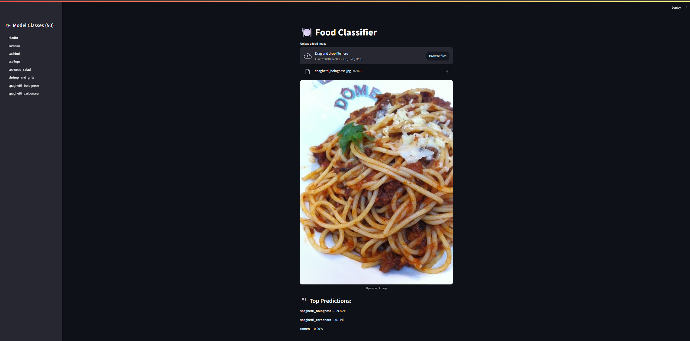

<!-- PROJECT LOGO -->
<br />
<div align="center">
  <a href="https://github.com/othneildrew/Best-README-Template">
    
  </a>

  <h3 align="center">Calorie Tracker</h3>
</div>

<!-- TABLE OF CONTENTS -->
<details>
  <summary>Table of Contents</summary>
  <ol>
    <li>
      <a href="#about-the-project">About The Project</a>
      <ul>
        <li><a href="#built-with">Built With</a></li>
      </ul>
    </li>
    <li>
      <a href="#getting-started">Getting Started</a>
      <ul>
        <li><a href="#prerequisites">Prerequisites</a></li>
        <li><a href="#installation">Installation</a></li>
      </ul>
    </li>
  </ol>
</details>


<!-- ABOUT THE PROJECT -->
## About The Project



* This project utilizes the EfficientNetB7 image classfication model for transfer learning. 
* The model was trained on 50 food classes from Food101. 
* Each food class had 700 training images and 300 testing images (also used for validation). 
* The model was feature extracted and then fine tuned several times to reach 80% accuracy.
* Streamlit was used to create a simple webpage to drag and drop images and see the models prediction.
* The model was uploaded to the Hugging Face Hub and then imported in the Streamlit script

<p align="right">(<a href="#readme-top">back to top</a>)</p>

### Built With
* [![TensorFlow][TensorFlow]][TensorFlow-url]
* [![Streamlit][Streamlit]][Streamlit-url]
* [![Python][Python]][Python-url]
* [![Hugging Face Hub][Hugging Face Hub]][HuggingFaceHub-url]
<p align="right">(<a href="#readme-top">back to top</a>)</p>


<!-- GETTING STARTED -->
## Getting Started
### Prerequisites

Python 3.10.0 must be used in order for tensorflow compatibility

<p align="right">(<a href="#readme-top">back to top</a>)</p>


### Installation
1. Clone the repo
   ```sh
   git clone https://github.com/nithinkosanam/Calorie-Tracker.git
   cd Calorie-Tracker
   ```
2. Install Dependencies
   ```sh
   pip install -r requirements.txt
   ```
3. Run the Streamlit app
   ```sh
   streamlit run app.py
   ```

<p align="right">(<a href="#readme-top">back to top</a>)</p>


<!-- MARKDOWN LINKS & IMAGES -->
[Streamlit-url]: https://streamlit.io/
[Streamlit]: https://img.shields.io/badge/Streamlit-FF4B4B?style=for-the-badge&logo=streamlit&logoColor=%23FFFFFF

[Python-url]: https://www.python.org/  
[Python]: https://img.shields.io/badge/Python-3776AB?style=for-the-badge&logo=python&logoColor=%23FFFFFF

[TensorFlow-url]: https://www.tensorflow.org/  
[TensorFlow]: https://img.shields.io/badge/TensorFlow-FF6F00?style=for-the-badge&logo=tensorflow&logoColor=%23FFFFFF

[HuggingFaceHub-url]: https://huggingface.co/  
[Hugging Face Hub]: https://img.shields.io/badge/Hugging%20Face%20Hub-FCC72B?style=for-the-badge&logo=huggingface&logoColor=%23000000

